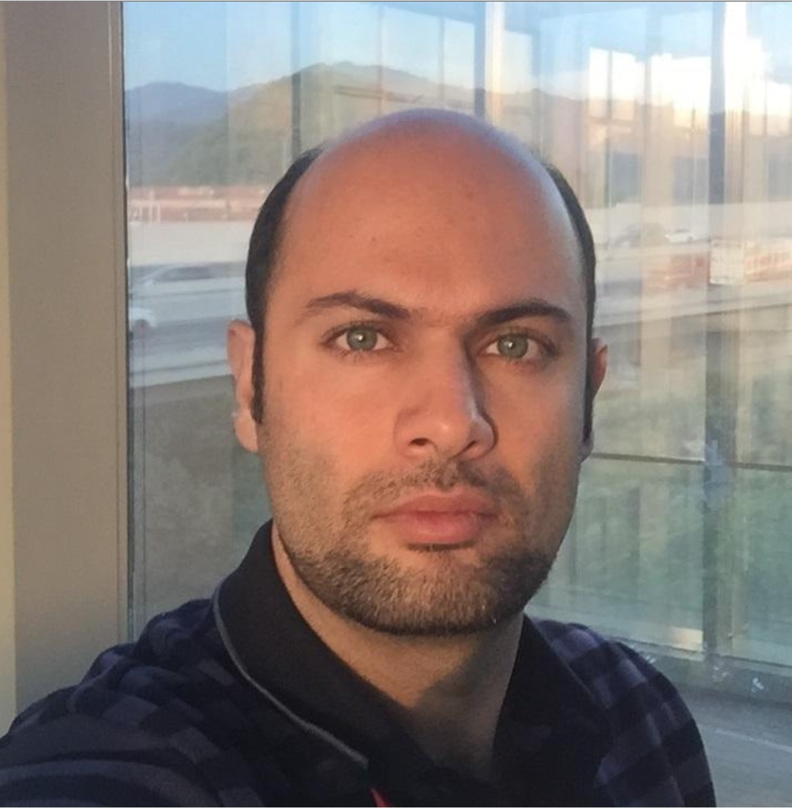

{width=250px}

Welcome! My background is in civil engineering. My PhD-level research focused on empirical approaches to earthquake damage correlation. I have developed an interest in data science, and I am working hard to quench it! My interests connect structural engineering, languages, machine learning, and natural language processing. I hope to strengthen my computational skills and apply them to interdisciplinary research and practical problems.

This is a Quarto website.

To learn more about Quarto websites visit <https://quarto.org/docs/websites>.
