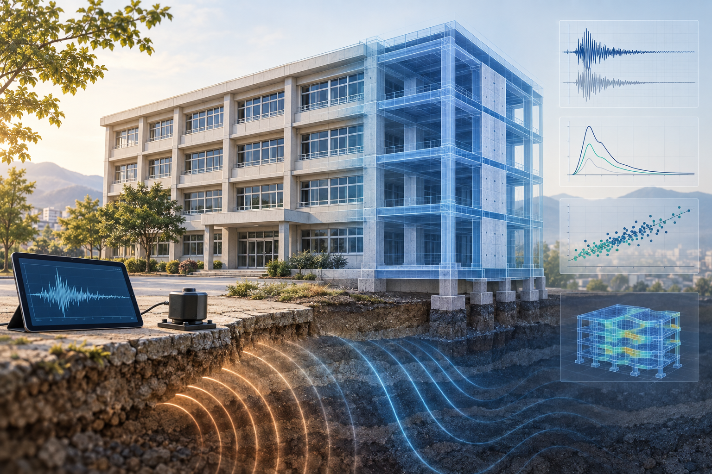

---
title: "Projects"
---

## RECoVER
{width=100%}
**Resilience-oriented Experimental–numerical Correlation Of Vibration, Energy, and Response**

RECoVER is a research framework I am developing as part of my doctoral work in earthquake engineering. It connects field observations, ambient vibration measurements, structural modelling, and earthquake response simulations to investigate relationships between ground motion, structural response, and observed building damage.

My research focuses on low- to mid-rise reinforced-concrete school buildings, with a case study of the schools affected by the 2023 Türkiye earthquake sequence. Through RECoVER, I aim to bring experimental evidence and numerical analysis into a consistent workflow for studying earthquake damage.

### Modules under development

| Module | Full name | Role in the framework |
|---|---|---|
| **SAVER** | Seismic Ambient Vibration Evaluation for Resilience | Analyses ambient vibration measurements to identify structural vibration characteristics and provide experimental targets for model assessment. |
| **DISASTER** | Dynamic Inference and Simulation Analysis for Structural Transformation and Earthquake Response | Uses MATLAB and OpenSees to simulate structural response to earthquake ground motions and evaluate response demands, energy measures, and damage indices. |
| **RESCuE** | Response-backbone Extraction and Simulation Calibration Using ETABS | Processes ETABS pushover results to derive structural backbones and parameters for simplified nonlinear models. |
| **SECURE** | Structural Earthquake-sequence Calibration for Undamaged-state Reverse Estimation | Handshakes ETABS OAPI and MATLAB and also seeks to estimate undamaged structural properties by comparing simulated post-sequence vibration characteristics with field measurements. |
| **PREPARE** | Predictive Resilience and Earthquake Performance Assessment through Response Evidence | Explores machine-learning approaches for relating earthquake intensity and simulated structural response to observed damage. |

### PEnD: Period, Energy, Damping

Alongside the framework’s modules, I am developing **PEnD**, which stands for **Period, Energy, Damping**. It represents a proposed pair of measures: the intensity measure **IM_PEnD** and the damage index **DI_PEnD**.

This work investigates how period, energy, and damping can inform the characterization of earthquake demand and structural damage. The proposed measures are being developed and evaluated within RECoVER.

### Connecting engineering and data science

Developing this framework has strengthened my interest in reproducible computing, data analysis, and machine learning. My studies in computational linguistics are also motivating me to explore how information in technical documents could support future engineering research.

**Project status:** Active research and development. The modules are at different stages of implementation and validation.
**Project fuled by:** Earthquake Engineering Research Facility